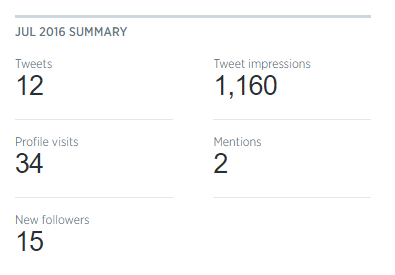
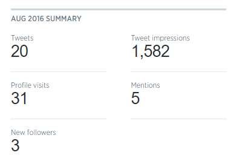

<!--- SET THE URL OF YOUR PRESENTATION. THIS WILL LOOK LIKE https://norfolkdatasci.github.io/YOUR-PRESENTATION-NAME-HERE --->
<meta property="og:url" content="https://norfolkdatasci.github.io/monthly-updates/2016-09">

<!--- MAKE THE TITLE THE SAME FOR THESE 2 METATAGS --->
<meta name="twitter:title" content="Monthly Update for September 2016">
<meta property="og:title" content="Monthly Update for September 2016">

<!--- MAKE THE COVER IMAGE THE SAME FOR THESE 2 METATAGS --->
<meta property="og:image" content="https://raw.githubusercontent.com/NorfolkDataSci/meetup-link/develop/norfolk-ds-logo2.png">
<meta name="twitter:image" content="https://raw.githubusercontent.com/NorfolkDataSci/meetup-link/develop/norfolk-ds-logo2.png">

<!--- MAKE THE DESCRIPTION THE SAME FOR ALL THESE METATAGS --->
<meta name="description" content="A guide for individuals relatively new to git and GitHub" />
<meta name="twitter:description" content="A guide for individuals relatively new to git and GitHub">
<meta property="og:description" content="A guide for individuals relatively new to git and GitHub" />

<!--- DONT TOUCH THESE METATAGS --->
<meta name="twitter:card" content="summary">
<meta name="twitter:site" content="@NorfolkDataSci">
<meta property="og:site_name" content="Norfolk Data Science" />
<meta name="twitter:creator" content="@NorfolkDataSci">
<meta property="og:type" content="website">

<!--- CHANGE THE HREF TO POINT TO YOUR REPOSITORY SO PEOPLE CAN FORK IT --->

<!--- DONT TOUCH --->

  

<!--- DONT TOUCH --->

Norfolk Data Science: <a href="http://www.meetup.com/NorfolkDataSci/" target="_blank">http://www.meetup.com/NorfolkDataSci/</a>

Norfolk Data Science
========================================
author: Regular Meeting
date: September 6, 2016
css: ../norfolk-data-sci-presentations.css

Sponsors
========================================
left: 40%

 
<u>Stack Overflow</u> 

  

     
    Donating Stickers
  

***

 
<u>O'Reilly Media, Inc.</u> 

  

     
    Offering 12 Free E-books
     
    <a href="www.oreilly.com/pub/get/757rug" target="_blank">www.oreilly.com/pub/get/757rug</a>
  

Job Opportunities
========================================

 
## EVMS - Speak to Dr. Tina Cunningham
 
## Booz Allen - Speak to William Reith

Digital Presence Analysis
========================================
left: 50%

  <a href="https://norfolkdatasci.github.io" target="_blank">https://norfolkdatasci.github.io</a>: 
  <i>Users</i>: 58&nbsp;&nbsp;&nbsp;&nbsp;&nbsp;<i>Pageviews</i>: 309&nbsp;&nbsp;&nbsp;&nbsp;&nbsp;<i>PVs per User</i>: 5.3
  

  <a href="https://meetup.com/NorfolkDataSci" target="_blank">https://meetup.com/NorfolkDataSci</a>: 
  <i>Users</i>: 225&nbsp;&nbsp;&nbsp;&nbsp;&nbsp;<i>Pageviews</i>: 40&nbsp;&nbsp;&nbsp;&nbsp;&nbsp;<i>PVs per User</i>: 1.8

 

***

 

Open Projects 
========================================

 

### Traffic in HR - Chris Brossman
https://github.com/NorfolkDataSci/trafficInHR

 

### Car Crashes with Bikes - Tim Dunbar
https://github.com/NorfolkDataSci/carCrashesWithBikes

Next Month's Meeting
========================================

 

<u>Main Presentation: TBD</u> 
<ul>
  <li>Food & Sponsors: Dominion Enterprises</li>
  <li>When: Tuesday, October 4th, 2016 @ 7:00 PM</li>
  <li>Where: Slover Library 105 Board Room</li>
</ul>
