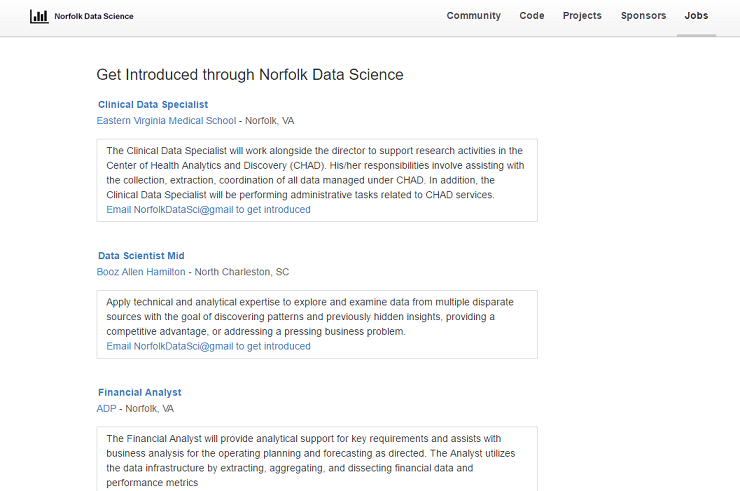
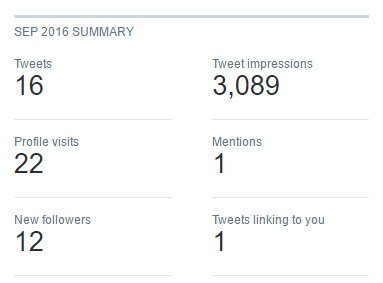

<! --- DONT TOUCH --->

  

<! --- DONT TOUCH --->

Norfolk Data Science: <a href="http://www.meetup.com/NorfolkDataSci/" target="_blank">http://www.meetup.com/NorfolkDataSci/</a>

<! --- CHANGE THE HREF TO POINT TO YOUR REPOSITORY SO PEOPLE CAN FORK IT --->

<! --- SET THE URL OF YOUR PRESENTATION. THIS WILL LOOK LIKE https://norfolkdatasci.github.io/YOUR-PRESENTATION-NAME-HERE --->
<meta property="og:url" content="https://norfolkdatasci.github.io/monthly-updates/2016-10">

<! --- MAKE THE TITLE THE SAME FOR THESE 2 METATAGS --->
<meta name="twitter:title" content="Monthly Update for October 2016">
<meta property="og:title" content="Monthly Update for October 2016">

<! --- MAKE THE COVER IMAGE THE SAME FOR THESE 2 METATAGS --->
<meta property="og:image" content="https://raw.githubusercontent.com/NorfolkDataSci/meetup-link/develop/norfolk-ds-logo2.png">
<meta name="twitter:image" content="https://raw.githubusercontent.com/NorfolkDataSci/meetup-link/develop/norfolk-ds-logo2.png">

<! --- MAKE THE DESCRIPTION THE SAME FOR ALL THESE METATAGS --->
<meta name="description" content="A guide for individuals relatively new to git and GitHub" />
<meta name="twitter:description" content="A guide for individuals relatively new to git and GitHub">
<meta property="og:description" content="A guide for individuals relatively new to git and GitHub" />

<! --- DONT TOUCH THESE METATAGS --->
<meta name="twitter:card" content="summary">
<meta name="twitter:site" content="@NorfolkDataSci">
<meta property="og:site_name" content="Norfolk Data Science" />
<meta name="twitter:creator" content="@NorfolkDataSci">
<meta property="og:type" content="website">

Norfolk Data Science
========================================
author: Regular Meeting
date: October 4, 2016
css: ../norfolk-data-sci-presentations.css

WiFi and Screenshare
========================================
 
Getting on Library WiFi:  
 
<u>Network Key</u>: nplwireless (first time only) 
<u>Username</u>: nplguest 
<u>Password</u>: nplguest 
 
Follow Tonight's Meeting at: 
<a href="https://join.freeconferencecall.com/norfolkdatasci">https://join.freeconferencecall.com/norfolkdatasci</a>

Next Month's Meeting
========================================

 
Presentation Starts at <b><u>6:30 PM</b></u> 
<ul>
  <li>Presentation: Outline and Practice with Git and GitHub</li>
  <li>Food & Sponsors: Sandwiches provided by Dominion Enterprises</li>
  <li>When: Tuesday, November 1st, 2016 @ 6:30 PM</li>
  <li>Where: Slover Library 105 Board Room</li>
</ul>

Jobs Board on Our Site
========================================

Please Share Your Job Opportunities!
 
<a href="https://norfolkdatasci.github.io/jobs">https://norfolkdatasci.github.io/jobs</a>

Contest Continuing
========================================

 

## Win a $25 Starbucks Gift Card!!

<ol>
  <li>Sign Up for Slack (<a href="https://norfolkdatasci.slack.com">https://norfolkdatasci.slack.com</a>)</li>
  <li>Create a Repo on GitHub (<a href="https://github.com/NorfolkDataSci">https://github.com/NorfolkDataSci</a>)</li>
  <li>Add 2 Issues on your GitHub repo</li>
</ol>

Digital Presence Analysis
========================================
left: 50%

  <a href="https://norfolkdatasci.github.io" target="_blank">https://norfolkdatasci.github.io</a>: 
  <i>Users</i>: 63&nbsp;&nbsp;&nbsp;&nbsp;&nbsp;<i>Pageviews</i>: 139&nbsp;&nbsp;&nbsp;&nbsp;&nbsp;<i>PVs per User</i>: 2.2
  

  <a href="https://meetup.com/NorfolkDataSci" target="_blank">https://meetup.com/NorfolkDataSci</a>: 
  <i>Users</i>: 313&nbsp;&nbsp;&nbsp;&nbsp;&nbsp;<i>Pageviews</i>: 593&nbsp;&nbsp;&nbsp;&nbsp;&nbsp;<i>PVs per User</i>: 1.8

 

***

 

